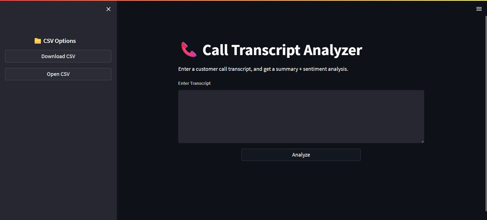
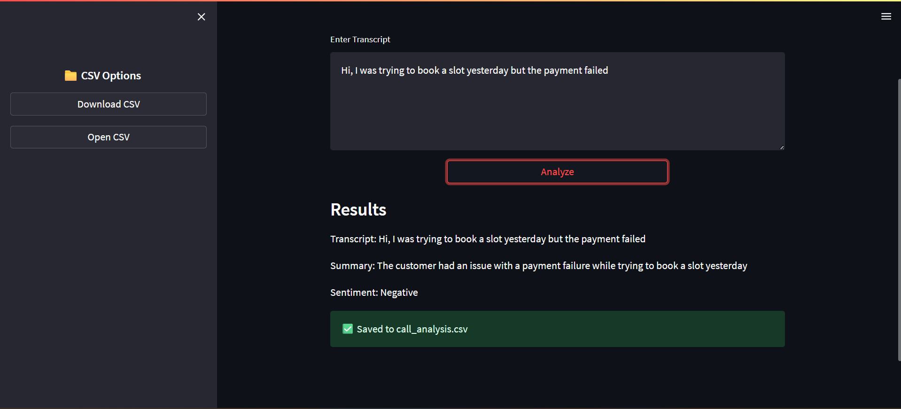
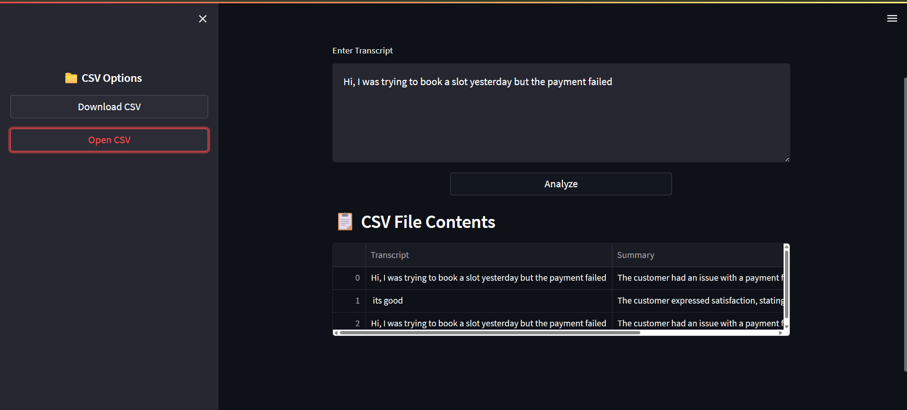

# 📞 Call Transcript Analyzer

A Streamlit-based web app that takes a **customer call transcript**, generates a **summary**, and performs **sentiment analysis** using the Groq API. The results are displayed in the UI and stored in a CSV file for further reference.

---

## 🚀 Features

* Enter any customer call transcript.
* Get:

  * **Summary** (2–3 sentences)
  * **Sentiment** (Positive / Neutral / Negative)
* Save results into `call_analysis.csv`.
* Download or open the CSV file directly in the app.
* Clean and responsive UI.

---

## 🖼️ Screenshots

### 🔹 Starting Page



### 🔹 Results Page



### 🔹 Open CSV File



---

## ⚙️ Installation

1. Clone the repo:

   ```bash
   git clone https://github.com/your-username/call-transcript-analyzer.git
   cd call-transcript-analyzer
   ```

2. Install dependencies:

   ```bash
   pip install -r requirements.txt
   ```

3. Run the app:

   ```bash
   streamlit run app.py
   ```

---

## 🔑 Setup API Key

You need a **Groq API key** to use this app.

1. Sign up at [Groq](https://groq.com/).
2. Generate an API key.
3. Replace `API_KEY` in `app.py` with your key:

   ```python
   API_KEY = "your_groq_api_key_here"
   ```

---

## 📂 Output

* Results are saved in `call_analysis.csv` with 3 columns:

  * **Transcript**
  * **Summary**
  * **Sentiment**

Example:

```csv
Transcript,Summary,Sentiment
"Hi, I was trying to book a slot yesterday but the payment failed", "Customer faced payment failure while booking a slot.", "Negative"
```

---

## 🎥 Demo Video

You can record a Loom/Zoom/Meet walkthrough of:

* Entering a transcript
* Analyzing the results
* Opening the saved CSV

(Link here after recording)

---

## 🤝 Contributing

Pull requests are welcome. For major changes, please open an issue first to discuss what you’d like to change.

---

